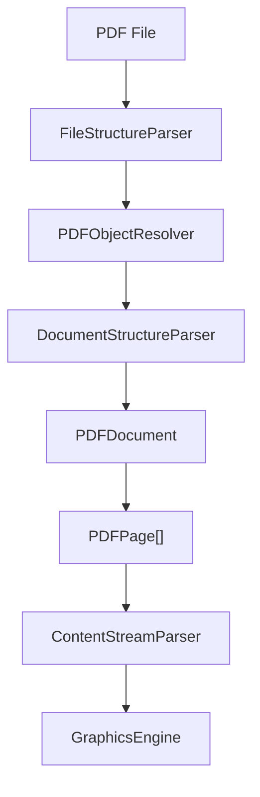

# 🧾 PDF Parser (TypeScript)

[](https://choosealicense.com/licenses/mit/)
[](https://www.typescriptlang.org/)
[](https://github.com/DamienGerard/pdf-processor)

A comprehensive, enterprise-grade TypeScript library for **parsing, editing, rendering, and processing** PDF files. Built **from scratch** with advanced features including content manipulation, security handling, form processing, and complete PDF editing capabilities, following the [ISO 32000-1:2008 PDF specification](https://www.adobe.com/content/dam/acom/en/devnet/pdf/pdfs/PDF32000_2008.pdf).

---

## ✨ Features

### 🔍 **Core PDF Processing**
- **Complete PDF Structure Parsing** - Header, cross-reference table, trailer, and objects
- **Advanced Tokenization** - Robust PDF tokenizer with error recovery
- **Object Resolution** - Handles indirect references and complex object graphs
- **Document Tree Navigation** - Complete catalog and page tree traversal

### ✏️ **PDF Editing & Manipulation**
- **High-Fidelity PDF Editing** - Edit PDFs with the same flexibility as DOCX files while preserving original formatting, fonts, and layout integrity
- **Text Content Manipulation** - Add, modify, delete, and reformat text with full typography control
- **Advanced Image Processing** - Insert, extract, replace, and manipulate images with scaling and positioning
- **Interactive Form Creation** - Build and modify complex PDF forms with validation and scripting
- **Annotation Management** - Create, edit, and manage comments, highlights, stamps, and markup annotations
- **Content Stream Editing** - Direct manipulation of PDF content streams for precise control

### 🎨 **Rendering & Graphics**
- **Graphics Engine** - Complete PDF graphics state management
- **Text Rendering** - Advanced typography and font handling
- **Image Rendering** - Multi-format image processing and rendering
- **PDF Rendering** - Full document rendering to various formats

### 🔒 **Security & Optimization**
- **Security Handler** - Encryption, decryption, and permission management
- **PDF Optimization** - File size reduction and structure optimization
- **Recovery System** - Robust error handling and document recovery
- **Font Management** - Advanced font embedding and substitution

### 🧪 **Testing & Quality**
- **Comprehensive Test Suite** - Jest-based testing framework
- **Sample Resources** - Multiple test PDF files included
- **Type Safety** - Full TypeScript type definitions

---

## 📁 Project Structure

```
pdf-processor/
├── 📄 jest.config.js               # Jest testing configuration
├── 📄 package.json                 # Project dependencies and scripts
├── 📄 tsconfig.json               # TypeScript configuration
│
└── 📂 src/
    ├── 📂 content/                 # Content processing and streams
    │   ├── ContentStreamParser.ts      # Parses PDF content streams
    │   ├── FontManager.ts              # Font handling and management
    │   └── StreamProcessor.ts          # Stream processing utilities
    │
    ├── 📂 core/                    # Core PDF document models
    │   ├── PDFDocument.ts              # Main document representation
    │   ├── PDFPage.ts                  # Individual page handling
    │   └── PDFParser.ts                # Primary PDF parsing interface
    │
    ├── 📂 editor/                  # PDF editing capabilities
    │   ├── AnnotationEditor.ts         # Annotation manipulation
    │   ├── FormEditor.ts               # Interactive form editing
    │   ├── ImageEditor.ts              # Image insertion and editing
    │   ├── PDFEditor.ts                # Main editing interface
    │   ├── TextEditor.ts               # Text content editing
    │   └── index.ts                    # Editor module exports
    │
    ├── 📂 parsing/                 # Low-level PDF parsing
    │   ├── FileStructureParser.ts      # File structure analysis
    │   ├── PDFObjectResolver.ts        # Object reference resolution
    │   └── PDFTokenizer.ts             # PDF token parsing
    │
    ├── 📂 processor/               # Specialized processors
    │   ├── FormProcessor.ts            # Form field processing
    │   └── ImageProcessor.ts           # Image handling and conversion
    │
    ├── 📂 renderer/                # Rendering and graphics
    │   ├── GraphicsEngine.ts           # PDF graphics state engine
    │   ├── ImageRenderer.ts            # Image rendering system
    │   ├── PDFRenderer.ts              # Complete document rendering
    │   └── TextRenderer.ts             # Text and typography rendering
    │
    ├── 📂 security/                # Security and encryption
    │   └── PDFSecurityHandler.ts       # Encryption and permissions
    │
    ├── 📂 structure/               # Document structure analysis
    │   ├── AnnotationProcessor.ts      # Annotation structure handling
    │   └── DocumentStructureParser.ts  # Document tree parsing
    │
    ├── 📂 types/                   # TypeScript type definitions
    │   ├── ContentTypes.ts             # Content-related types
    │   ├── PDFTypes.ts                 # Core PDF types
    │   └── SecurityTypes.ts            # Security-related types
    │
    └── 📂 utils/                   # Utility functions
        ├── PDFOptimizer.ts             # PDF optimization utilities
        └── PDFRecoveryHandler.ts       # Error recovery and repair

📂 tests/                          # Test suite
├── 📂 core/                       # Core functionality tests
│   └── PDFPage.test.ts
├── 📂 parsing/                    # Parser tests
│   ├── FileStructureParser.test.ts
│   ├── PDFObjectResolver.test.ts
│   └── PDFTokenizer.test.ts
└── 📂 resources/                  # Test PDF files
    ├── sampleFile.pdf
    └── sampleFile2.pdf
```

---

## 🚀 Quick Start

### Installation

```bash
# Clone the repository
git clone https://github.com/your-username/pdf-parser-ts.git
cd pdf-parser-ts

# Install dependencies (currently none for runtime!)
npm install

# Build the project
npm run build
```

### Basic Usage

```typescript
import { parsePdfFile } from './src/parsePdfFile';
import * as fs from 'fs';

// Load and parse a PDF file
const buffer = fs.readFileSync('sample.pdf');
const pdfDoc = parsePdfFile(buffer);

// Access document information
console.log(`📄 Total pages: ${pdfDoc.pages.length}`);
console.log(`📋 Title: ${pdfDoc.info?.title || 'Untitled'}`);

// Iterate through pages
pdfDoc.pages.forEach((page, index) => {
    console.log(`Page ${index + 1}:`, page.mediaBox);
});
```

### Running the Example

```bash
# Compile TypeScript
tsc

# Run your test
node dist/test.js
```

---

## 🔧 How It Works

The parser follows a systematic approach to PDF processing:

| Component | Responsibility |
|-----------|----------------|
| **FileStructureParser** | Reads PDF bytes, tokenizes, and parses objects |
| **PDFObjectResolver** | Handles cross-references and resolves object relationships |
| **DocumentStructureParser** | Traverses from Catalog through the Pages tree |
| **PDFPage** | Represents pages with MediaBox, Resources, and Contents |
| **ContentStreamParser** | Interprets drawing commands and operators |
| **GraphicsEngine** | Processes PDF graphics operations *(coming soon)* |

### Architecture Overview



---

## 📚 References & Resources

- 📖 [ISO 32000-2 PDF Specification](https://developer.adobe.com/document-services/docs/assets/5b15559b96303194340b99820d3a70fa/PDF_ISO_32000-2.pdf) - Official PDF standard

---

## 🧪 Development Status

### ✅ Completed Features
- [x] Parse object table and cross-reference section
- [x] Resolve indirect references and object graphs
- [x] Build page tree and extract PDFPage objects
- [x] Basic document structure parsing

### 🚧 In Progress
- [ ] Content stream parsing and interpretation
- [ ] Graphics engine implementation
- [ ] Text and font extraction
- [ ] Advanced operator handling

### 🎯 Planned Features
- [ ] Form field extraction
- [ ] Annotation processing
- [ ] Digital signature validation
- [ ] NPM package distribution

---

## 🛠️ Development

### Prerequisites
- Node.js 16+ 
- TypeScript 4.8+

### Setup
```bash
# Install development dependencies
npm install

# Run in development mode
npm run dev

# Format code
npm run format

# Run tests
npm run test

# Build for production
npm run build
```

### Contributing

Contributions are most welcomed. Here's how to proceed:
1. Fork the repository
2. Create your feature branch (`git checkout -b feature/amazing-feature`)
3. Commit your changes (`git commit -m 'Add amazing feature'`)
4. Push to the branch (`git push origin feature/amazing-feature`)
5. Open a Pull Request

---

## 📄 License

This project is licensed under the MIT License - see the [LICENSE](LICENSE) file for details.

---

## 👨‍💻 Author

**Damien Gerard**
- GitHub: [@DamienGerard](https://github.com/DamienGerard)
- Email: denis.damien.gerard@gmail.com
- LinkedIn: [Damien Gerard](https://www.linkedin.com/in/damien-g-a468b8109/)

---

## 🙏 Acknowledgments

- Adobe Systems for the comprehensive PDF specification
- The TypeScript community for excellent tooling

---

<div align="center">

**Built with ❤️ and TypeScript**

[⭐ Star this repo](https://github.com/DamienGerard/pdf-processor) | [🐛 Report Bug](https://github.com/DamienGerard/pdf-processor/issues) | [✨ Request Feature](https://github.com/DamienGerard/pdf-processor/issues)

</div>
